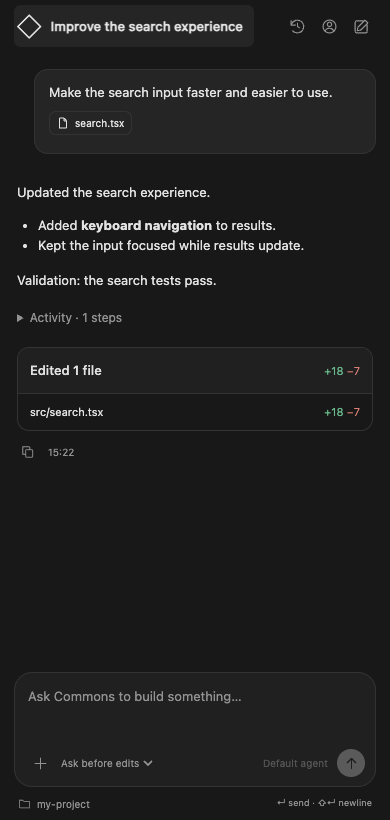

# Agent Commons for VS Code

Your agents, right beside your code. Chat with Agent Commons, attach files, review
local edits, and return to earlier conversations without opening a terminal.



## Get started

1. Install [Agent Commons from the Visual Studio Marketplace](https://marketplace.visualstudio.com/items?itemName=AgentCommons.agent-commons).
2. Open a project folder and click **Agent Commons** in the Activity Bar
   (`Cmd+Alt+A` / `Ctrl+Alt+A`).
3. Select **Continue with Commons** and approve sign-in in your browser.
4. Choose an agent in the composer and describe what you want to build.

Requires VS Code 1.95+ and Node.js 22+ on the extension host. For Remote SSH, WSL,
and Dev Containers, install Node on the remote host. A Commons account and agent
are required; usage follows your account's billing. The extension is free.

The Node runtime is bundled. You do not need to install the CLI separately.
For an offline extension installation, download `agent-commons.vsix` from the
[GitHub releases](https://github.com/Arttribute/agent-commons/releases) and run
**Extensions: Install from VSIX…**.

## Chat and context

- Stream responses directly in the sidebar. **Enter** sends; **Shift+Enter** adds a line.
- Use **+** to attach files or the current editor file/selection, including unsaved text.
- Drop files onto the composer or paste images. Remove attachment chips before sending.
- Attach up to 10 files, each up to 10 MB. Small text files are included as context;
  images, documents, and larger files use Commons file uploads.
- Use `@src/file.ts` to reference a project file when local tools are enabled.
- Right-click code to **Explain Selection or File** or **Review Selection or File**.
  These actions start a fresh read-only conversation.
- Your agent controls model selection. Choose another agent in a new chat to change it.
- The stop button ends local processing and disconnects the stream. Remote tools
  already in progress may finish on the server.

## History and changes

The history button opens searchable conversations across your agents. Filter to
**This project** for chats previously opened in this project, rename a chat from
its row menu, or select one to continue with its original agent. The new-chat
button starts a separate conversation. Each chat keeps its own composer draft.
Only one response runs at a time in a VS Code window.

Tool activity starts collapsed. Expand it to inspect commands, arguments, and
results. File-change cards show replacement-hunk line counts and expandable
previews. **Review in editor** opens saved before/after snapshots in the native
VS Code diff editor. File references in responses open inside your project.

Direct file-tool writes are captured as they happen. In Git projects, completed
turns also compare text files before and after commands (up to 500 KB per file and
10 MB per snapshot). Binary files and files beyond these bounds are not included.
Changes made concurrently by another editor or process can appear in this comparison.
Use Source Control for a complete repository diff. An unsaved editor buffer blocks
agent writes to that file until you save it.

## Account and permissions

The account button shows your identity, a link to Commons account settings, agent
selection, extension settings, and sign-out. Browser sign-in uses a one-time code;
no password or API key is entered into the webview. Signing out also signs the
shared CLI out on this machine.

| Mode | Local behavior |
| --- | --- |
| Ask before edits | Read project files; ask in chat before each edit or command |
| Read only | Read project files; deny edits and command execution |
| Tools off | Disable local tools; explicitly attached context is still sent |

Approved commands run with your operating-system permissions. They are not sandboxed.
Local file tools reject project escapes, symlink escapes, and common credential
locations such as `.env`, `.ssh`, `.aws`, and `.agc`. Explicit file-picker attachments
may be outside the project. The filter is not a comprehensive secret scanner.
Local permissions do not change the agent's remote platform permissions.

Prompts, attached files, project instructions (`AGENTS.md`), and tool results are
processed by Agent Commons and the agent's model provider. The extension adds no
analytics. Credentials remain in the CLI's protected `~/.agc/config.json`; they
never enter webview state or process arguments. Conversation and diff snapshots
are stored in VS Code workspace storage, separated by account. Drafts use webview
state. Sign-out hides history but does not delete local snapshots or remote chats.

## Settings and troubleshooting

Use **Agent Commons: Open Settings** to configure:

- `agentCommons.nodePath`: Node.js 22+ executable, machine-scoped. Set an absolute
  path if Node is not on PATH, then reload the window.
- `agentCommons.localTools`: default permission mode for new chats.

If sign-in expires, retry for a fresh code. If agents or history fail to load, check
your network and sign in again. Create your first agent at
[Agent Commons](https://www.agentcommons.io) if your account has none.
Browser-only VS Code and untrusted workspaces are unsupported.

## Development

```sh
pnpm install --frozen-lockfile
pnpm --filter @agent-commons/sdk build
pnpm --filter @agent-commons/cli typecheck
pnpm --filter agent-commons typecheck
pnpm --filter agent-commons test
pnpm --filter agent-commons build
python3 packages/commons-vscode/test/terminal-smoke.py
pnpm --filter agent-commons package
```

`test/extension-host.cjs` runs with VS Code's `--extensionTestsPath` flag.
`test/browser-smoke.cjs` exercises the webview in Playwright; install Playwright or
set `COMMONS_PLAYWRIGHT_PATH` to its module. Optionally set
`COMMONS_BROWSER_EXECUTABLE` to a Chromium executable.
Tests use isolated accounts and API fixtures, including browser authorization,
streaming, attachment upload, edit approval/denial, history, and stream failures.

The `VS Code Extension` workflow tests Linux, Windows, and macOS. A `vscode-vX.Y.Z`
tag matching the package version publishes a GitHub release and VSIX. A manual
workflow run on main with `publish_marketplace` enabled publishes that tested
artifact using the `VSCE_PAT` repository secret. Never commit publishing credentials.
